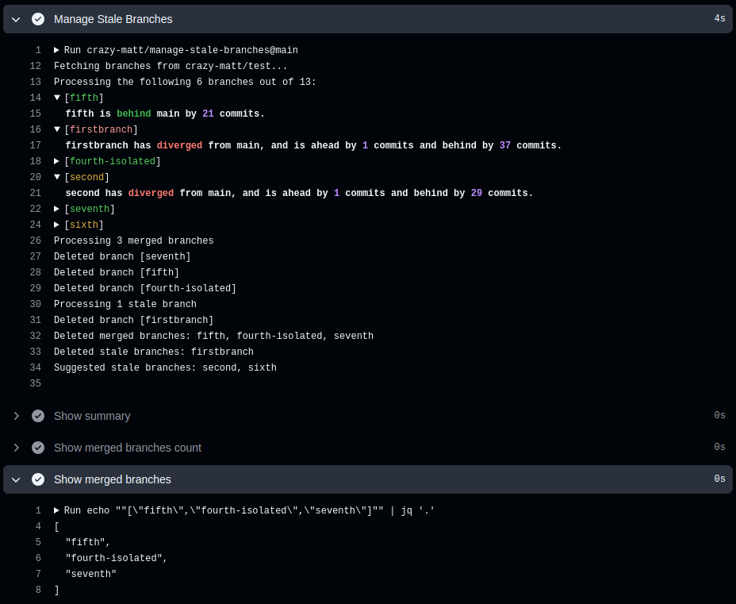

# manage-stale-branches  <!-- omit in toc -->

[](https://github.com/crazy-matt/manage-stale-branches/actions/workflows/integration.yaml)
[](https://github.com/crazy-matt/manage-stale-branches/actions/workflows/github-code-scanning/codeql)
[](https://github.com/crazy-matt/manage-stale-branches/actions/workflows/release.yaml)
[](https://github.com/crazy-matt/manage-stale-branches/actions/workflows/release.yaml)

<table border="0" cellspacing="0" cellpadding="0" style="border-collapse: collapse;">
<tr>
<td width="70%" style="border: 0; vertical-align: top; padding: 0;">

This action deletes branches that haven't had a commit in the last `stale-duration`, and suggest branches which could be deleted due to their inactivity on the last `suggested-duration`.

⚠️ The branches already merged to the **default branch** are automatically deleted if the action isn't set for `dry-run` mode.

If you set the `dry-run` input to true, the action will simply output a preview of what would be done in no dry-run mode.

</td>
<td valign="top" style="border: 0; padding: 0 0 0 20px;">

<details open="open">
<summary>Table of Contents</summary>

- [Using the Action](#using-the-action)
  - [Preview](#preview)
  - [Minimalistic Workflow](#minimalistic-workflow)
  - [Sample Workflow](#sample-workflow)
- [Inputs](#inputs)
- [Outputs](#outputs)

</details>

</td>
</tr>
</table>

## Using the Action

In your GitHub workflows, you can reference the action by:

```yaml
- uses: crazy-matt/manage-stale-branches@v3      # Always use the latest 3.x.x
- uses: crazy-matt/manage-stale-branches@v3.0    # Always use the latest 3.0.x
- uses: crazy-matt/manage-stale-branches@v3.0.1  # Use this specific version
```

For more information, refer to the [GitHub Actions Quickstart](https://docs.github.com/en/actions/quickstart).

### Preview

<div align="center"></div>

### Minimalistic Workflow

```yaml
on:
  push

jobs:
  job1:
    runs-on: ubuntu-latest
    permissions:
      contents: write
    steps:
      - uses: crazy-matt/manage-stale-branches@v3
```

> you don't need to checkout your repository as this action uses the Github API.

### Sample Workflow

```yaml
on:
  schedule:
    - cron: "0 12 * * 1"  # Run every monday at 12 pm

jobs:
  job1:
    runs-on: ubuntu-latest
    permissions:
      contents: write
    steps:
      - name: Manage Stale Branches
        uses: crazy-matt/manage-stale-branches@v3
        with:
          stale-duration: 60d
          suggested-duration: 30d
          dry-run: true
          archive-stale: true
          rate-limit-threshold: 95
          exclude-patterns: |
            release
            ^keep-this.*
```

> Restore your branches with `git checkout -b <branch name> archive/<branch name>`.

<!-- action-docs-inputs source="action.yml" -->
## Inputs

| name | description | required | default |
| --- | --- | --- | --- |
| `github-token` | <p>GitHub Token with repository write access.</p> | `false` | `${{ github.token }}` |
| `stale-duration` | <p>Time threshold for stale branches (e.g., "60d", "2w", "1440h"). Accept only a single unit.</p> | `false` | `60d` |
| `suggested-duration` | <p>Time threshold for suggested branches (e.g., "30d", "1w", "720h"). Accept only a single unit.</p> | `false` | `30d` |
| `concurrency` | <p>Number of branches to process concurrently.</p> | `false` | `4` |
| `dry-run` | <p>Run in dry-run mode (no actual deletion).</p> | `false` | `true` |
| `archive-stale` | <p>Archive instead of deleting stale branches.</p> | `false` | `false` |
| `exclude-patterns` | <p>Branches to exclude from cleanup. It can be a comma-separated list or a multiline string (yaml list). It can use regex patterns.</p> | `false` | `""` |
| `rate-limit-threshold` | <p>GitHub API rate limit threshold percentage (0-100). The action will exit gracefully when the rate limit usage reaches this threshold. The action defaults to no threshold (100).</p> | `false` | `100` |
<!-- action-docs-inputs source="action.yml" -->

<!-- action-docs-outputs source="action.yml" -->
## Outputs

| name | description |
| --- | --- |
| `summary` | <p>Summary of deleted/suggested branches.</p> |
| `merged-branches` | <p>JSON array string listing the merged branches which have been deleted. Used in dry-run mode, you can pass it easily to a matrix job to handle yourself these branches.</p> |
| `merged-branches-count` | <p>Deleted merged branches count.</p> |
| `stale-branches` | <p>JSON array string listing the stale branches. Used in dry-run mode, you can pass it easily to a matrix job to handle yourself these branches.</p> |
| `stale-branches-count` | <p>Stale branches count.</p> |
| `suggested-branches` | <p>JSON array string listing the branches suggested for deletion. Used in dry-run mode, you can pass it easily to a matrix job to handle yourself these branches.</p> |
| `suggested-branches-count` | <p>Suggested branches count.</p> |
<!-- action-docs-outputs source="action.yml" -->
